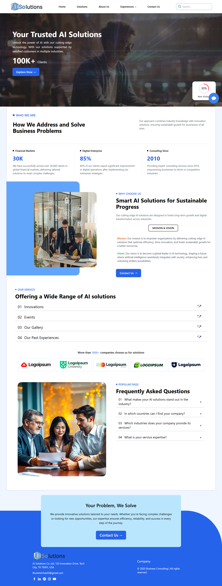
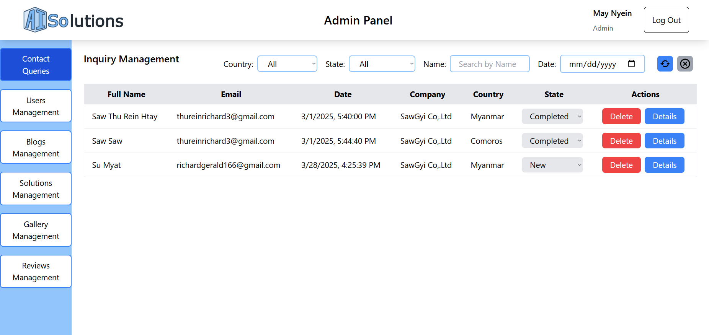
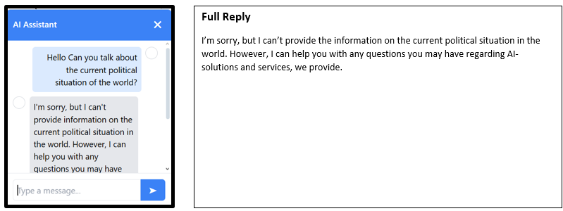

#Frontend Code of Full Stack Dynamic Website (AI Solutions Website)

  

A full-stack dynamic website developed for the fictional company **AI Solutions**, designed to showcase AI services, industry expertise, blogs, and customer interactions.  
The platform includes an AI chatbot, an admin management system, and database-driven content management.

This project demonstrates the development of a modern web application using **React, TypeScript, Flask, and MySQL**, along with structured software development methodology and extensive testing.

---

## Project Overview

The website serves multiple purposes:

- Showcase company services, expertise, and vision  
- Allow potential clients to contact the company  
- Provide blogs and information pages  
- Display industry reviews and image gallery content  
- Allow administrators to manage content through an admin panel  
- Provide users with an AI-powered chatbot assistant

---

## Key Features

### User Features

- Modern, responsive website interface  
- Interactive navigation with search functionality  
- AI chatbot for company-related questions  
- Contact form with confirmation emails  
- Dynamic blogs and solutions pages  
- Industry reviews and image gallery  
- Mobile, tablet, and desktop responsiveness  

### Admin Panel Features

- Authentication: secure login, role-based access (Admin / Staff), logout  
- Contact query management: view, update status, delete, filter, search  
- User management: add, edit, delete, filter, search  
- Blog management: create, edit, delete blogs with images  
- Solutions management: add, edit, delete solutions  
- Gallery management: upload, edit, delete images  
- Reviews management: add, edit, delete reviews, automatic category handling  

---

## Technology Stack

- **Frontend:** React, TypeScript, Tailwind CSS, React Router  
- **Backend:** Python, Flask  
- **Database:** MySQL  

---

## Screenshots

  

  

  

More screenshots available here:  
[View all screenshots](screenshots/)

Read Design Documentation for detailed insights
[View Design Documentation](screenshots/DesignDocumentation.pdf)

---

## Future Improvements

- Two-factor authentication  
- File exporting features  
- Enhanced mobile responsiveness  
- Advanced security features  
- More sophisticated AI chatbot capabilities  

---

## Author

**Saw Thu Rein Htay**  
Full-Stack Developer | Web & Mobile Development  

Email: thureinrichard3@gmail.com

---

